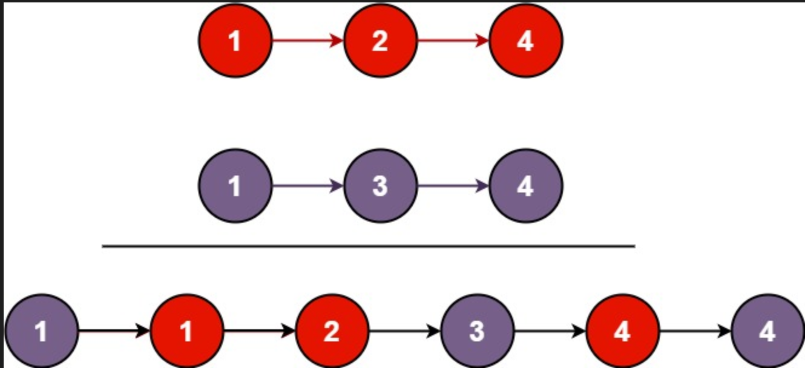

### 题目
将两个升序链表合并为一个新的升序链表并返回。新链表是通过拼接给定的两个链表的所有节点组成的。 
示例 1：

```
输入：l1 = [1,2,4], l2 = [1,3,4]
输出：[1,1,2,3,4,4]
```

示例 2：
```
输入：l1 = [], l2 = []
输出：[]
```

示例 3：
```
输入：l1 = [], l2 = [0]
输出：[0]
```

提示：

两个链表的节点数目范围是 [0, 50]
-100 <= Node.val <= 100
l1 和 l2 均按 非递减顺序 排列

### 解题
这题也比较简单，同时遍历两个链表，判断结点大小，取较大结点即可。
代码实现：
```py
class Solution:
    def mergeTwoLists(self, l1: ListNode, l2: ListNode) -> ListNode:
        p1 = l1
        p2 = l2
        result = None
        p_result = None
        while p1 or p2:
            p_temp = None
            if p1 is None:
                p_temp = p2
                p2 = p2.next
            elif p2 is None:
                p_temp = p1
                p1 = p1.next
            else:
                if p1.val > p2.val:
                    p_temp = p2
                    p2 = p2.next
                else:
                    p_temp = p1
                    p1 = p1.next
            if result is None:
                result = p_temp
                p_result = result
            else:
                p_result.next = p_temp
                p_result = p_result.next
        return result
```
这是我一开始想到的解法，显然条件判断比较多，个人认为还是比较好理解的。那么别人是怎么解的呢？
下面是LeetCode找到的高赞解法：
```py
class Solution:
    def mergeTwoLists(self, l1: ListNode, l2: ListNode) -> ListNode:
        dummy = cur = ListNode(0)
        while l1 and l2:
            if l1.val < l2.val:
                cur.next = l1
                l1 = l1.next
            else:
                cur.next = l2
                l2 = l2.next
            cur = cur.next
        cur.next = l1 or l2
        return dummy.next
```
可以看到代码简洁了很多，但是两种解法的时间复杂度都是一样的。我自己想的解法为什么代码量比较大呢？
1. 没有使用哨兵结点，导致需要去对result结点判空
2. 不清楚Python可以``cur.next = l1 or l2``这样的用法

不过呢，使用哨兵结点的话，会导致有一个空余的结点，个人不太喜欢。